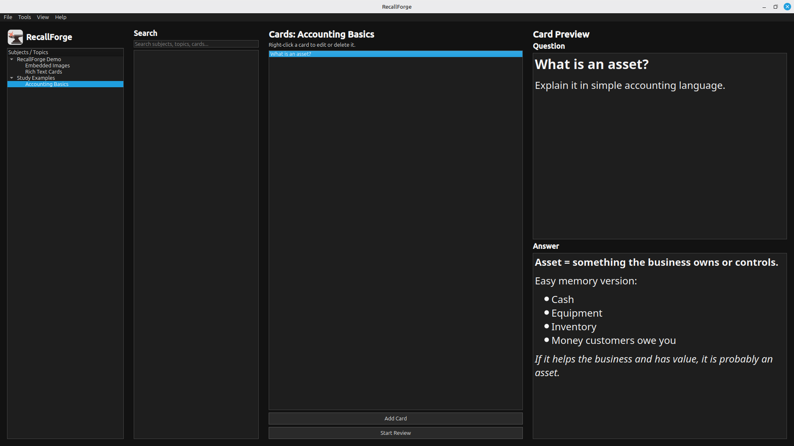

<p align="center">
  
</p>

---

# RecallForge

RecallForge is a local-first desktop flashcard learning application for organizing, reviewing, and retaining knowledge through a hierarchy of subjects, topics, and rich-text flashcards.
Cards support formatting, lists, and embedded images, allowing users to build visually rich learning material while keeping all data private and fully offline.

Built with Python, PySide6, and SQLite.

---

## Features

### Knowledge Organization

✔ Subject Management

* Create subjects
* Rename subjects
* Delete subjects
* Organize knowledge into categories

✔ Topic Management

* Create topics inside subjects
* Rename topics
* Delete topics
* Structured hierarchy organization

✔ Card Management

* Create flashcards
* Edit flashcards
* Delete flashcards
* Rich-text question editor
* Rich-text answer editor
* Bold formatting
* Italic formatting
* Underline formatting
* Font size controls
* Bullet lists
* Numbered lists
* Embedded images
* Topic-based organization


---

### Learning System

✔ Review Mode

* Review cards one at a time
* Reveal answers on demand
* Anki-style rating buttons
* Again
* Hard
* Good
* Easy

✔ Review History

* Every review is recorded
* Rating history is preserved
* Learning activity tracking

✔ Learning Engine

* Learning strength classification
* New cards
* Weak cards
* Familiar cards
* Strong cards

✔ Pressure-Free Learning

RecallForge intentionally avoids:

* Due dates
* Overdue cards
* Daily quotas
* Forced schedules

Learn at your own pace.

---

### Visual Learning

✔ Embedded Image Support

Supported formats:

* PNG
* JPG
* JPEG
* WEBP
* SVG

Features:

* Embedded images inside questions
* Embedded images inside answers
* Rich text and images together
* Card preview rendering
* Review mode rendering
* SVG rendering support
* Local image storage


---

### Search

✔ Integrated Search System

Search through:

* Subjects
* Topics
* Question text
* Answer text

Features:

* Real-time search
* Rich-text content search
* Case-insensitive matching
* Unified search results

---

### Statistics

✔ Collection Statistics

* Total subjects
* Total topics
* Total cards


✔ Review Statistics

* Total reviews
* Reviews today
* Reviews this week
* Rating breakdown

✔ Learning Statistics

* New cards
* Weak cards
* Familiar cards
* Strong cards

---

### Import & Export

✔ JSON Export

* Backup collections
* Transfer knowledge bases
* Preserve structure
* Preserve rich-text formatting
* Preserve embedded images

✔ JSON Import

* Restore backups
* Import collections
* Validation and safety checks
* Restore rich-text formatting
* Restore embedded images

---

### User Experience

✔ Rich Text Editor

* Bold formatting
* Italic formatting
* Underline formatting
* Font size controls
* Bullet lists
* Numbered lists
* Embedded images
* Rich text preview
* Rich text review mode

✔ Scrollable Card Preview

✔ Scrollable Review Mode

✔ Dark Mode

✔ Light Mode

✔ Theme Persistence

✔ Application Branding

✔ Local-First Design

✔ Fully Offline Operation

---

## Installation

Clone the repository:

```bash
git clone https://github.com/damir-bubanovic/RecallForge.git
cd RecallForge
```

Create and activate a virtual environment:

```bash
python3 -m venv .venv
source .venv/bin/activate
```

Install dependencies:

```bash
pip install -r requirements.txt
```

---

## Running the Application

```bash
python3 main.py
```

---

## How RecallForge Works

1. Create a subject
2. Create topics inside the subject
3. Create rich-text flashcards
4. Add formatting, lists, and images
5. Review cards
6. Build review history
7. Track learning strength
8. Analyze statistics

---

## Project Structure

RecallForge/
│
├── app/
│   ├── cards/
│   ├── dialogs/
│   ├── hierarchy/
│   ├── import_export/
│   ├── preview/
│   ├── review/
│   ├── search/
│   ├── statistics/
│   ├── styles/
│   ├── theme/
│   ├── utils/
│   ├── widgets/
│   └── main_window.py
│
├── database/
│   ├── connection.py
│   ├── schema.py
│   ├── subjects.py
│   ├── topics.py
│   ├── cards.py
│   ├── reviews.py
│   ├── learning.py
│   ├── search.py
│   ├── statistics.py
│   ├── import_data.py
│   └── export_data.py
│
├── assets/
│   ├── logo.svg
│   └── screenshot.png
│
├── data/
├── tests/
│
├── main.py
├── FEATURES.md
├── README.md
└── requirements.txt

---

## Design Philosophy

RecallForge follows a simple philosophy:

* Local-first
* Offline-first
* User-controlled
* Privacy-focused
* Rich-content learning
* Pressure-free learning

Your knowledge belongs to you.


---

## Creator

Damir Bubanovic

GitHub:

https://github.com/damir-bubanovic

Project Repository:
https://github.com/damir-bubanovic/RecallForge

---

## License

MIT License
